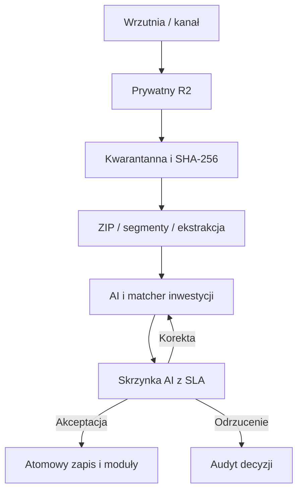

# ProjectOctopus: obieg dokumentów i routing AI

Stan wdrożenia na 2026-08-22. Dokument opisuje działający obieg i jego warstwy operacyjne. Interfejs pozostaje prosty: użytkownik wrzuca dokument i podejmuje tylko decyzje, których system nie może podjąć bezpiecznie.

## Obieg end-to-end

1. Serwer podpisuje intencję uploadu: firma, inwestycja, plik, kategoria i blokada ręcznej kategorii.
2. Plik trafia bezpośrednio do prywatnego R2. API potwierdzenia sprawdza rozmiar i sygnaturę rzeczywistej zawartości.
3. Jedna transakcja zapisuje dokument, wersję, intake i trwały job. Trigger i unikalny `job_key` chronią przed zgubieniem oraz duplikacją zadania.
4. Worker pobiera pełny plik, liczy SHA-256 i uruchamia adapter skanera malware. Wynik `infected` zawsze oznacza kwarantannę i trwały dead letter; przy polityce fail-closed niedostępny skaner również zatrzymuje proces.
5. Bezpieczny ZIP jest rozwijany do osobnych dokumentów z manifestem, limitami i ochroną przed traversal, bombą kompresyjną, duplikatami, szyfrowaniem i niespójnością nagłówków. Duże opracowania są zapisywane jako wznowalne segmenty ze wskazaniem strony/sekcji.
6. Worker wykonuje ekstrakcję Word/Excel/tekst lub analizę PDF/obrazu przez Gemini i zapisuje wynik strukturalny. AI rozpoznaje kategorię, metadane, fakty, wymagania, protokoły, BOQ i dane biznesowe. Wynik nie uruchamia skutków biznesowych przed decyzją człowieka.
7. Dopasowanie inwestycji wykorzystuje nazwę, kod, inwestora, lokalizację, numer kontraktu, nazwę roboczą i aliasy wyuczone z zatwierdzonych korekt. Niski wynik albo mała różnica między kandydatami wymusza wybór w Skrzynce AI.
8. Skrzynka AI ma priorytet, właściciela, SLA, widok „Moje”, automatyczną eskalację i alert. Akceptacja jest atomowa: zatwierdza klasyfikację i ekstrakcję, przenosi dane do wybranej inwestycji, uruchamia właściwe moduły oraz zapisuje audyt.
9. Faktury i WZ/PZ z niepełnymi danymi trafiają do Business Inbox. Nie powstają sztuczne faktury ani ruchy magazynowe. Uzgodnienie pokazuje ścieżkę BOQ → zamówienie → PZ → faktura oraz odchylenia ilości, ceny, budżetu i VAT.
10. Odrzucenie wycofuje wszystkie propozycje tej wersji. Ponowna analiza zatwierdzonej wersji jest zabroniona; korekta wymaga nowej wersji dokumentu.

## Routing modułów

| Kategoria | Moduł docelowy | Skutek po akceptacji |
|---|---|---|
| Dokumentacja, STWiOR, umowa, korespondencja | Inwestycje / Dokumentacja | fakty, wymagania, źródła i wersje |
| Kosztorys / przedmiar | Inwestycje / Kosztorys | import BOQ w stanie do kontroli |
| Harmonogram | Inwestycje / Harmonogram | kontekst etapów i zależności |
| Protokół | Inwestycje / Protokoły | wymagania protokołów i dowodów |
| Wniosek materiałowy | Inwestycje / Wnioski | wymagania materiałowe |
| Faktura | Finanse | faktura, pozycje, alokacje i kontrola zakupu |
| WZ / PZ / dostawa | Magazyn | Business Inbox i projekt ruchu magazynowego |
| Kadry | Kadry | bezpieczny routing do domeny kadrowej |
| Flota | Flota | bezpieczny routing do domeny floty |
| Wzór | Wzory | szkic wersji wzoru do osobnej akceptacji |
| Raport / inne | Raporty / Skrzynka AI | analiza i ręczna decyzja |

## Zasady bezpieczeństwa

- R2 pozostaje prywatne, a adresy uploadu i pobrania są krótkotrwałe.
- Plik z wynikiem skanowania `infected` nie może być analizowany, pobrany ani dołączony do data roomu.
- Kategoria i blokada kategorii są częścią podpisanego tokenu, więc klient nie może zmienić ich przy potwierdzeniu uploadu.
- Każda domena jest sprawdzana ponownie dla końcowej kategorii i końcowej inwestycji.
- RPC uploadu i akceptacji są dostępne wyłącznie dla `service_role`; aplikacja wykonuje autoryzację użytkownika przed wywołaniem.
- Dane operacyjne pozostają `proposed` do akceptacji. Profil inwestycji i autopilot odświeżają się dopiero po niej.
- Błędy chwilowe mają retry z backoffem; błędna sygnatura, rozmiar lub SHA-256 kończą zadanie bez bezsensownych ponowień.
- Każda analiza, decyzja i automatyczna orkiestracja zapisuje zdarzenie audytowe.
- Triage, callback integracyjny i publikacja data roomu są transakcjami atomowymi. Równoczesny callback z tym samym kluczem źródłowym zwraca istniejący dokument i usuwa nadmiarowy obiekt R2.
- Szkic data roomu może podejrzeć wyłącznie osoba zatwierdzająca; użytkownik z odczytem otrzymuje dostęp dopiero po publikacji.
- Etap wymagający podpisu dostawcy nie przyjmuje dowodu podanego przez klienta. Musi go potwierdzić osobny, zweryfikowany callback integracji podpisu.

## 10 wdrożonych funkcji i zastosowań

| # | Funkcja | Przykładowe użycie | Stan wdrożenia |
|---|---|---|---|
| 1 | Wielokanałowa skrzynka dokumentów | API, e-mail bridge, KSeF, ERP, formularz terenowy i skaner korzystają ze wspólnego intake | Gotowe: autoryzacja bearer, idempotency key, kanał i audyt; konektory dostawców podłącza się do wspólnego kontraktu API |
| 2 | Kontrolowane paczki dokumentów | ZIP dokumentacji powykonawczej tworzy osobny dokument i status dla każdego pliku | Gotowe: parser bezpieczeństwa, limity, manifest, oddzielne joby i kwarantanna |
| 3 | Analiza dużych opracowań | Wielostronicowy projekt jest dzielony na wznowalne części | Gotowe: segmenty, strony/sekcje, checksumy, jakość i Gemini Files API; geometryczne współrzędne obszaru zależą od dostawcy ekstrakcji |
| 4 | Radar zmian między wersjami | Rewizja pokazuje zmianę kwoty, terminu, zakresu, faktu lub pozycji BOQ | Gotowe: before/after, wpływ finansowy i terminowy, ryzyko, confidence i osobna decyzja |
| 5 | Uczący się matcher inwestycji | Korekta „Wysoka, nie Centrum” wzmacnia alias dla kolejnych plików | Gotowe: feedback, aliasy, dowody dopasowania oraz mierniki precision/recall/korekt na danych zweryfikowanych przez człowieka |
| 6 | SLA Skrzynki AI i eskalacje | Krytyczny dokument ma właściciela i nie pozostaje bez decyzji | Gotowe: polityki SLA, priorytet, „Moje”, claim/release, eskalacja, alert recenzenta i automatyczne zamknięcie alertu |
| 7 | Macierz kompletności inwestycji | Kierownik widzi braki od przygotowania do odbioru | Gotowe: 112 wymagań startowych w aktywnej bazie, wynik kompletności, terminy, własne wymagania, waive/restore i powiązania z dokumentami |
| 8 | Uzgodnienie BOQ–PO–PZ–faktura | Zakup jest kontrolowany względem zamówienia, dostawy, kosztorysu i VAT | Gotowe: odchylenia ceny, ilości, budżetu i podatku, wymiary kosztowe, confidence i bramka akceptacji |
| 9 | Wielostopniowe akceptacje i podpis | Dokument przechodzi kolejne role, a decyzja ma niezmienny ślad | Gotowe: workflow, kroki, instancje, decyzje i podpis wewnętrzny SHA-256 + aktor + czas; podpis kwalifikowany wymaga integracji z certyfikowanym dostawcą |
| 10 | Retencja, legal hold i data room | Paczka odbiorowa zawiera wyłącznie zatwierdzone, dozwolone wersje | Gotowe: polityki, legal hold, kontrolowany wewnętrzny data room, manifest, publikacja/cofnięcie i dziennik pobrań; portal publicznego odbiorcy pozostaje osobną integracją |

## Ograniczenia świadome i bezpieczne

- Adapter malware jest gotowy, ale rzeczywiste skanowanie wymaga adresu dostawcy w `OCTOPUS_MALWARE_SCAN_URL`. Dla produkcji zalecane jest `OCTOPUS_REQUIRE_MALWARE_SCAN=true`.
- Podpis wewnętrzny zapewnia integralność i audyt aplikacyjny. Nie jest sam w sobie podpisem kwalifikowanym ani zaufanym.
- Data room jest kontrolowanym kanałem wewnętrznym. Dostęp zewnętrznego odbiorcy wymaga osobnego modelu tożsamości i procesu zaproszeń.
- Startowe polityki retencji mają status `draft`; okresy należy zatwierdzić z osobą odpowiedzialną za wymogi prawne i kontraktowe.

## Kontrola wdrożenia

- `CRON_SECRET`, Gemini i R2 muszą być ustawione w środowisku uruchomieniowym. Kanały zewnętrzne dodatkowo wymagają `OCTOPUS_INTEGRATION_TOKEN`.
- Małe i średnie pliki uruchamiają analizę natychmiast po wpływie. Dzienny cron `/api/brain/worker` przetwarza awaryjnie maksymalnie pięć jobów; częstszy harmonogram wymaga planu obsługującego częstsze crony albo zewnętrznej kolejki.
- Przed przełączeniem skanera malware w tryb fail-closed należy skonfigurować endpoint, token i test syntetycznego pliku EICAR w odseparowanym środowisku dostawcy.
- Migracje lokalne muszą przejść pełny łańcuch oraz sprawdzenie uprawnień funkcji.
- Po wdrożeniu należy obserwować: czas kolejki, retry/dead letter, odsetek korekt kategorii i inwestycji, jakość ekstrakcji oraz czas decyzji w Skrzynce AI.
